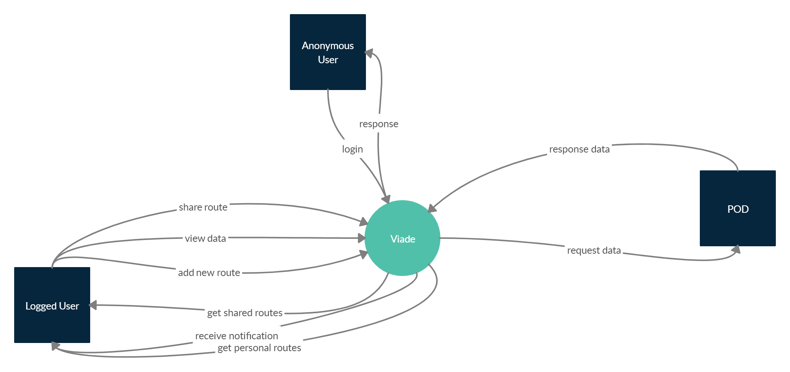

[[section-system-scope-and-context]]
== System Scope and Context

[role="arc42help"]
****
.Contents
The system must be a web application based on the new technology called SOLID. This must be a system that allows you to upload and share routes with friends. 

The main advantage of this system is to avoid storing personal information in a external server. The user is the owner of their information and decides with whom to share it. It allows us to have a clear separation between the data and the application because the information is stored in a POD, which is unique for each user, and allows to store their information inside it. This provides us privacy, security and guarantees.

The following information must be allowed to be stored:

* *Routes*
* *Images*
* *Videos*
* *Plain text*

The information exchange will be done by typing in the POD of the user logged in. If you want to share some information, the other user will be given permission to read only the recurring information.

****

=== Business Context

[role="arc42help"]
****
The different stakeholders in the software product we are dealing with are the following: 

* *Anonymous user*
* *Logged user*
* *POD*
* *POD Server*: Composite of PODs

The next stakeholders are candidates to be considered in the future:

* *Friend user*
* *Teacher*
* *Inrupt Workers*

[%header,cols=3*] 
|===
| Communication Partner             | Input									| Output
| Anonymous User					| Text              	                | Access to POD
| Logged User						| Route              	                | Route, images, videos
| POD								| Route, images, videos, text			| RDF
|===

****

=== Technical Context

[role="arc42help"]
****
.Contents
Technical interfaces (channels and transmission media) linking your system to its environment. In addition a mapping of domain specific input/output to the channels, i.e. an explanation with I/O uses which channel.

.Motivation
Many stakeholders make architectural decision based on the technical interfaces between the system and its context. Especially infrastructure or hardware designers decide these technical interfaces.

.Form
E.g. UML deployment diagram describing channels to neighboring systems,
together with a mapping table showing the relationships between channels and input/output.

****

**<Diagram or Table>**

**<optionally: Explanation of technical interfaces>**

**<Mapping Input/Output to Channels>**
