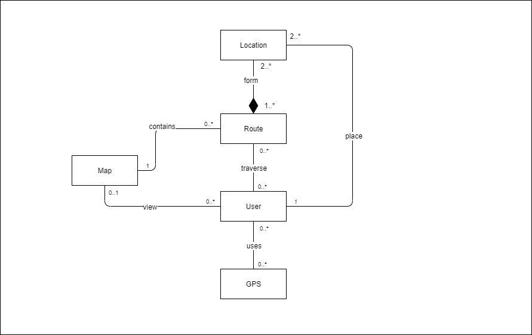

[[section-concepts]]
== Cross-cutting Concepts

[role="arc42help"]
****
This section describes overall, principal regulations and solution ideas that are
relevant in multiple parts (= cross-cutting) of your system.
Such concepts are often related to multiple building blocks.
They can include many different topics, such as:

* *Domain Model*
* *Architecture patterns and design patterns*
* *Rules for using specific technology*
* *Principal, often technical decisions of overall decisions*
* *Implementation rules*
* *Domain concepts*
* *User Experience concepts (UX)*
* *Safety and security concepts*
* *"Under-the-hood"*
* *Development concepts*
* *Operational concepts*

_The following image shows most of the concepts to be treated, as well as the elements that form each of these._

image:images/08-Crosscutting-Concepts-Structure-EN.png["Possible topics for crosscutting concepts"]

The following points will provide an overview of each concept mentioned.
****
=== Domain Model
[role="arc42help"]
****
Below is the domain model of the route management application.

****

=== Architecture Patterns and Design Patterns
[role="arc42help"]
****
.Architecture Patterns
Throughout the development of this project, we will build on the architectural pattern "Model Controller View":

* Divides an interactive application in to 3 parts as, model — contains the core functionality and data view — displays the information to the user (more than one view may be defined) controller — handles the input from the user. This is done to separate internal representations of information from the ways information is presented to, and accepted from, the user. It decouples components and allows efficient code reuse.

.Design Patterns
As for design patterns, patterns such as observer are likely to be used:

* Define una dependencia uno-a-muchos entre objetos, de modo que cuando un objeto cambia su estado, todos los demás objetos dependientes se modifican y actualizan automáticamente. 

More patterns will be used such as the factory method:

* It is a design pattern that defines an interface to create an object, but lets the subclasses decide which class to instantiate. It allows a class to delegate the creation of objects in its subclasses.
****

=== Rules for Using Specific Technology
[role="arc42help"]
****
For the use of the application, only a series of steps will be necessary:

* Open browser
* Enter the URL corresponding to the application
* From here you can already do actions like search routes
* In order to access more features of the application a registration will be necessary. This step can be skipped if you are already registered in the route management application.
* Log in to your account
* Now you have extra functionalities such as being able to add friends, create your own routes and publish them. You will also have configuration options like editing the profile, etc.
****

=== Principal, Often Technical Decisions of Overall Decisions
[role="arc42help"]
****
The team of developers reserves the right to be able to modify the application at any time, always to try to fix or improve existing aspects or to add any other that is considered convenient.
Therefore we do not take care of any problem caused by such change.
****

=== Implementation rules
[role="arc42help"]
****
As for the implementation, we will always try to make the decision that assumes that the code is less coupled, dividing the code by layers. In this way it will be much easier to modify any type of change and in turn fix any existing fault. Any type of pattern that assumes a good balance between the difficulty of understanding and modifying the code and the increase in performance that this entails will be used.
Duplication of the code will be avoided.
****

=== User Experience concepts (UX)
[role="arc42help"]
****
We will try to make the user have a good experience with the application, providing a friendly interface that will consist of fundamental things such as:

* A registration / login
* Search and filter routes, being able to access them for a more detailed description.
* Possibility that the user can create and delete their routes.
* Configuration of the user profile.
****

=== Safety and security concepts
[role="arc42help"]
****
We will not be as dedicated to security as to other aspects, but if we focus on data privacy, this application will be safe,
since based on solid, you will get all the route data that the customer will be providing throughout your stay in the application
they will be stored in your terminal and not in a centralized data system as other important companies like Facebook and Instagram do.
To this we add the "https" protocols that increase security in the browser.
****

=== Development concepts
[role="arc42help"]
****
Within the development concepts, the concept of "Build, Test, Deploy" should be highlighted. This concept is what we will rely on to fulfill a good design.
The design process looks more or less like this:

* Generating a concept
* Refining ideas through visual exploration
* Preparation of approximate designs that detail the design directions
* Establish preliminary specifications for typography and graphic elements such as photography, illustration, pictures or graphics, icons or symbols
* Presentation of short designs and general designs for customer consideration
* Refining design and complete designs, if necessary
* Obtain customer approval of designs and text before the next phase

There are other concepts such as code generation, migration, configurability that we will not enter but that we will take into account when making our application.
****

=== Operational concepts
[role="arc42help"]
****
There are numerous operational concepts among which the following stand out:

* Disaster-Recovering: independent infrastructure of advanced technology superior to Backup that focuses on business continuity and is the recommended solution for Critical Mission roles. It protects and restores not only 100% of the Client's data, but also restores the operation of an entire organization in a matter of minutes regardless of the size of the data.
* Clustering: Group potential customers in similar characteristics according to their visits and behavior on a website.
* Monitoring: It is based on the continuous supervision of the application to detect possible errors early and that these can be solved in the shortest possible time.

It should be noted that we will not use the disaster-recovering option due to the lack of resources we currently have at our disposal. Also we will use another technique called backup. In this way we can restore the web application in case of an unexpected error.
****